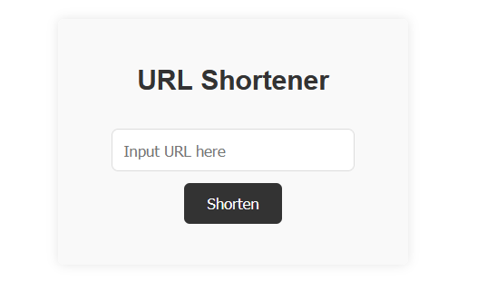

# AC URL shortener

Transform your URLs into short, manageable links that are easier to track. It's built by using [Node.js](https://nodejs.org/en) + [Express](https://www.npmjs.com/package/express), with the template engine [express-handlebars](https://www.npmjs.com/package/express-handlebars).

## Preview

## Environment Setup

This project requires [Node.js](https://nodejs.org/en) to be installed on your system for execution.

## Features

- Store shortened URLs to guarantee that identical source URLs are matched to the same link, and different source URLs to different links.
- Click the button to instantly copy the link.

## Installing

Execute the installation process in the terminal (for Windows users, execute on [Git Bash](https://gitforwindows.org/)):

1. Use the following command to clone this project to your desired local folder: `https://github.com/ZeYuanDuan/URL-shortener.git`

2. Change directory to the project folder: `cd URL-shortener`

3. Install npm packages: `npm install`

4. run the server: `npm run dev`

To access the website, enter the URL in your browser: [http://localhost:3000](http://localhost:3000), or click on the link in the console.
